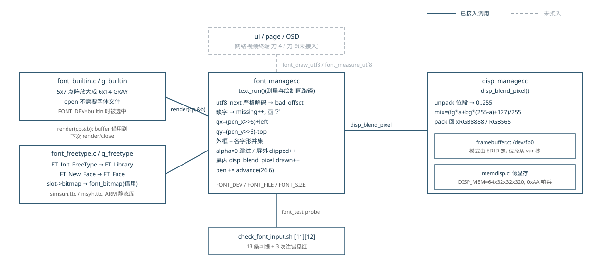

# 04 font 层：从 UTF-8 到帧缓冲灰度合成

## 一、动机

display 层（第 03 章）收尾时，`project/` 已经能把 `0x00RRGGBB` 写进 16/32 位
framebuffer 并用独立脚本对显存逐像素对账，判据 52 条。上层离"画出 `A中g`"还差四件事：
字节序列到码点的解码、码点到字形的选取、字形在基线上的摆放、覆盖率与背景色的合成。
这四件事任何一件错了一环，症状都一样是屏幕上没字或位置错，所以每一环都要有能数的判据。

课程资料给出了 FreeType 的最短调用链，它不能直接作为项目实现，四个缺陷都在源码里：
`FT_Library` 与 `FT_Face` 从不释放；取位图按 `width` 算行跨度，遇到 FreeType 实际允许的
负 `pitch` 与行尾填充就读错行；字形纵坐标不按 baseline 与 bearing 推导；灰度字节被当成
最终颜色写进显存，抗锯齿信息全部丢失。它能在一个固定字体、固定画面上出现文字，
换负 `pitch`、边缘裁剪、RGB565 或半透明后便没有一处是对的。

网络视频终端路线（`Todo/项目路线图-网络视频终端.md`）里 font 层的角色是 OSD 叠加：
时间戳、帧率、传感器读数写在画面上。ui/page 两层与 OSD 都只需要同一句话：
"给我一个码点序列，还我外框、推进量与画好的像素"——provider 是谁它不该知道。

本章把文字显示做成 font 层：manager 只处理统一字形，builtin 与 FreeType 分别提供字形；
测量与绘制走同一条排版路径；display 层新增逐像素 alpha 合成。

## 二、为什么是这几步

```
F1  定义 provider 与字形借用契约
F2  写 builtin / FreeType 两个 provider
F3  严格解码 UTF-8，测量与绘制共用一条排版路径
F4  在 display 层按真实位段做 alpha 合成
F5  用可控探针、真字体、ARM 构建和真 framebuffer 固化判据
```

工作量由字形数据自身的性质推出。FreeType 渲染完一个字形，交给调用方的是：
宽 `width`、高 `rows`、行跨度 `pitch`（可为负，与 `width` 独立）、像素模式
（MONO 每位一个像素，GRAY 每字节一个覆盖率）、`num_grays`、bearing（`bitmap_left`
与 `bitmap_top`，相对当前笔位与基线）、26.6 定点的 advance，以及一块由 FreeType
自己管理的 `buffer`。这八样里有三样会让调用方出错：`pitch` 与 `width` 独立、
灰度是覆盖率而调用方想要颜色、`buffer` 有效期由库决定。F1 的契约必须把这三样
写成明文，manager 才可能不复制 FreeType 的内部结构。

F1 必须最先做：契约不定，两个后端各自解释位图，manager 无法对上层保持同一行为。
F2 提供一个无外部文件的确定性后端和一个生产后端——判据要能反复跑出逐字节相同的
显存，只能靠前者；中英文真字形只能靠后者。F3 把字符串变成有位置的字形序列，
测量与绘制共用同一条循环，按钮布局的预测值和实际墨迹才不会是两套规则。
F4 放在字形之后：覆盖率只有乘上 framebuffer 当前的背景与位段才是颜色，
而位段只有 display 层知道。F5 收口：每条判据配一次注错见红，最后在真 framebuffer
上确认硬件位深与字体文件。

少一步都不成立：没有 F1，F2 的两个后端行为对不齐；没有 F2 的 builtin，
F5 的全部像素判据都依赖一份字体文件，换机器就跑不了；没有 F3 的统一路径，
测量返回的外框与实际画出的墨迹会漂移；没有 F4，灰度写进 RGB565 只剩黑白两色，
抗锯齿白做；没有 F5，3.1 节那三处契约只会以静默错误结果的形式回来。

图 1 是本章结束时的状态。



**图 1** 左列两个 provider 挂同一条注册链表，manager 按名字选中其一；右列 display
层的混色入口是本章新增的 `disp_blend_pixel()`。灰色虚线是按同一接口接下去的
OSD/ui 下游，本章不做。

## 三、每一步做了什么

### 3.1 字形借用契约

`font/font_internal.h` 定义 `font_bitmap`，每个字段带单位：

```
struct font_bitmap
 width   位图有效列数                像素
 rows    位图行数                    像素
 pitch   相邻两行行首的跨度          字节, 允许为负
 pixel_mode  MONO(每位一像素) / GRAY(每字节一覆盖率)
 num_grays   GRAY 模式的灰度级数
 left    字形左边缘相对 pen 的偏移   像素
 top     字形上边缘相对基线的高度    像素, 向上为正
 advance_x/y_26_6  画完后 pen 的推进 1/64 像素
 buffer  只读位图数据, 借用到下一次 render/close
```

`buffer` 的借用期限写进头文件注释：provider 负责存储，manager 只在本次处理该字形时
可读，下一次 `render` 或 `close` 之后旧指针失效。manager 因此不复制 FreeType 的内部
位图，也不会在 provider 更新槽位后继续持有旧指针。

对上层只公开 `font_text_metrics`（墨迹外框、26.6 advance、码点数、缺字数、
覆盖/绘制/裁剪像素数）与四个函数：选 provider、设像素尺寸、测量、绘制。
`bad_offset` 在 UTF-8 非法时写首个坏字节下标，成功写 `(size_t)-1`。

### 3.2 两个 provider

builtin 是 5x7 英文/数字/标点点阵，纵向放大一倍成 6x14 灰度图（点分量的 5 列居中在
6 列里），不依赖任何字体文件；查不到的码点由 manager 计入 `missing` 并改画问号。
`set_pixel_size` 只做参数检查，缩放是常量。

FreeType 的资源是两层：`FT_Init_FreeType` 建 library，`FT_New_Face` 在 library 之上
建 face。关闭按反序：

```
  打开:  FT_Init_FreeType ──> FT_New_Face
  关闭:  FT_Done_Face ──> FT_Done_FreeType
```

`freetype_close()` 逐个检查并释放、句柄清 NULL，打开前、打开失败、font 层退出
三处复用同一个函数。`FT_Load_Char(..., FT_LOAD_RENDER)` 之后槽位里才有位图；
`font_freetype.c` 把槽位的八个字段逐项映射进 `font_bitmap`，`FT_Face` 类型不出这个文件。
支持的像素模式是 GRAY 与 MONO，其余显式返回 `ERR_NOTSUP`。

### 3.3 严格解码与同一条排版路径

`utf8_next()` 按固定顺序检查：首字节决定序列长度（`0xc2..0xdf` 两字节、
`0xe0..0xef` 三字节、`0xf0..0xf4` 四字节，其余拒绝）→ 剩余长度够不够 →
每个续字节高两位是不是 `10` → 拼出的码点是不是过长编码、UTF-16 代理区、
超出 U+10FFFF。顺序不能换：还没确认 `n >= need` 就读 `s[2]`，会先越过调用方的缓冲区。
`C0 AF` 这类过长编码在首字节就被拒绝，给它配上续字节也不合法。

排版与绘制在同一条 `text_run()` 里，`draw` 参数决定是否落像素：

```
   text + len
      │ utf8_next: 字节 → 码点, 失败则写 bad_offset 返回
      ▼
   has_codepoint? ──否──> missing++, 码点换成 '?'
      │ 是
      ▼
   render(码点) → font_bitmap        [provider 借出 buffer]
      │
      ▼
   gx = (pen_x >> 6) + b.left        26.6 先累加后取整
   gy = (pen_y >> 6) - b.top         top 向上为正, 屏幕 Y 向下
      │
      ├──> metrics_add_box: 外框取各字形并集
      └──> draw 时: 逐像素取 alpha → 0 跳过 / 屏外 clipped++ /
                     屏内 disp_blend_pixel 后 drawn++
      │
      ▼
   pen += advance (26.6), off += used
```

一次 `font_draw_utf8("A中g", 5, 10, 20, rgb, &m, &bad)` 的值变化：
`off` 走 0→1→4→5（字节偏移），`codepoints` 走 1→2→3（码点数），两条计数在结尾
分别得到 5 和 3。每个字形先合并外框再逐像素绘制，全部成功后才把局部 metrics
一次写进调用方的 `m`；中途失败返回错误并写 `bad_offset`，半成品指标不外发。

### 3.4 framebuffer alpha 合成

`disp_blend_pixel()` 先把背景像素按运行时位段展开回 0..255：

```
unpack:  value = (pixel >> offset) & (2^length - 1)
         展开 = (value * 255 + mask/2) / mask      四舍五入回 8 位
```

再逐通道混合后压回：

```
result = (前景 * alpha + 背景 * (255 - alpha) + 127) / 255
```

`alpha=0` 直接返回（少一次读显存），`alpha=255` 直接写前景色。手算校验
背景 `0x204060`、前景 `0xe0a020`、alpha=64 的红通道：
`(224×64 + 32×191 + 127) / 255 = 20575 / 255 = 80 = 0x50`，
与判据里探针的第二个像素 `00505850` 一致。

RGB565 每通道只有 5/6 位，很小的非零 alpha 在 8 位运算后可能是 1，压回 5 位后
成为 0。所以"覆盖像素数"与"回读非黑像素数"是两个量，见 4.4 节。

### 3.5 构建与判据

x86 走系统 `pkg-config freetype2`。ARM 从资料包的 FreeType 2.10.2 源码在
`build/arm/deps/freetype/` 内隔离交叉构建静态库，头文件进 `CPPFLAGS`，静态库放在
`LDLIBS`，用 `.installed` 戳文件把构建挂在 `font_freetype.o` 与最终链接之前：

```
FT_TARBALL ─tar─> FT_SRC ─configure+make─> FT_STAGE ─touch─> FT_STAMP
FT_STAMP ──> font_freetype.o ; $(BIN) $(TESTS) ─order-only─> FT_STAMP
```

这避免把开发机动态库带进产物，也绕开工具链 glibc 2.41 与板上 2.30 的版本冲突
（第 03 章已实测动态产物起不来，修法是静态链接）。

判据在 `check_font_input.sh` 的 [11]/[12] 两组，13 条：负 `pitch`、每行带填充的
4x2 灰度探针（`unittest/font_test.c` 注册成第三个 provider）、alpha=0/64/128/255
逐通道对账、四边裁剪各自命中、行尾 0xAA 哨兵完好、真字体的码点/缺字/advance/
抗锯齿色数，加三次注错见红。

## 四、遇到的问题

### 4.1 参考实现的资源生命周期没有闭合

**第一现场**（课程参考源码，原始记录丢失，按当时的阅读笔记还原）：全文件只有
`FT_Init_FreeType` / `FT_New_Face`，退出路径没有对应释放。

**解读** 短命单测不报告问题：进程退出时操作系统回收一切，ASan 的 leak 检测
在正常退出路径上也不触发。但本项目运行期会切换字体（`font_select` 关旧开新），
每次切换漏一对 library/face，长跑累积。

**定位** 阅读 `freetype_open` 的失败分支时发现：`FT_New_Face` 失败时 library
已经创建，参考实现直接 return，半开资源无处归还。

**根因与修法** 清理集中进幂等的 `freetype_close()`，open 前（换字体）、open 失败、
font 层退出三处复用。原判据没有覆盖到它：当时全部判据跑一次就退出，没有任何
"反复 init/select/exit 后资源不增长"的长跑判据；ASan 退出码判据只能证明单程无泄漏。

### 4.2 `pitch` 不能用 `width` 代替

**第一现场**（判据 [11r1] 注错输出，2026-10-03 实跑）：

```
注错: 负 pitch 仍按正方向逐行
  PASS  注错见红: 8 个 alpha 探针的顺序 变成
        [00e0a020 00807040 00505850 00204060 00204060 00505850 00204060 ...
```

（正确顺序是 `00204060 00505850 00807040 00e0a020` 起头的对称序列，注错后整体反序。）

**解读** 探针位图 `pitch=-6`、每行 4 有效像素 + 2 字节填充，逻辑首行放在内存后半。
忽略负号按正方向取行，读到的覆盖率恰好整体颠倒，alpha 梯度对称所以八个像素全部变色。

**定位** 参考实现按 `width` 逐行推进（`row = buffer + y * width`），在正 `pitch`
且无填充的位图上碰巧正确。FreeType 的 `pitch` 与 `width` 是两个独立字段，负值
表示行序自底向上。

**根因与修法** `bitmap_alpha()` 用 `stride = abs(pitch)` 定位行首，负 `pitch` 时取
`rows-1-y` 行。为什么当初的判据没覆盖到：判据此前全用正 `pitch`、无填充的探针，
错误根本不会触发；补上这个 fixture 后"肉眼看到字"永远验证不出这类错误。

### 4.3 ARM 不能链接开发机的 FreeType

**第一现场**（构建输出，按当时的问题记录还原，原始文本未存档）：交叉编译时把
x86 的 `pkg-config` 结果带进了 ARM 链接，报主机路径下的动态库/新 glibc 约束错误，
产物上不了板。

**解读** 两条路都封死：主机动态库不能进 ARM 产物；板上 glibc 2.30 低于工具链
2.41，任何动态链接新库的产物都报 `GLIBC_2.38 not found`。

**定位** 第 03 章的结论（静态链接 495 KB 产物）在 FreeType 上同样适用，于是从
资料包源码隔离构建。第一次完整验收时判据脚本把 `project/` 复制进 `/tmp` 再跑，
Makefile 里的相对路径 `../../01_all_series_quickstart-master/...` 在副本里失效，
`missing tarball` 退出。

**根因与修法** 依赖包路径改为环境变量展开成绝对路径（`check.sh` 里
`FT_TARBALL=${FT_TARBALL:-/mnt/e/...}`），构建树、stage、stamp 全部放进
`build/$(ARCH)`，两个架构互不污染。原判据为什么没覆盖到：旧判据脚本复制源码时
没有任何第三方源码依赖，没有"副本里依赖包还能找到"这一条；补进总入口后复跑
72/0/0（当时 input 层判据未合入）。

### 4.4 RGB565 把极低覆盖率量化成黑色

**第一现场**（板上回读，2026-09-23 实测）：font 统计 1758 个非零覆盖像素
（`covered/drawn/clipped = 1758/1758/0`），回读 `/dev/fb0` 整屏只数出 1663 个
非黑像素，差 95。

**解读** 差值不是越界或漏画：`drawn=1758` 说明每次混色调用都返回成功。
RGB565 的绿 6 位、红蓝各 5 位，`unpack` 回 8 位再乘小 alpha 混色后，8 位结果
可能只有个位数的值，压回 5/6 位四舍五入后落到 0，写进显存就是黑。

**定位** 把 covered 与 nonblack 强行相等的判据草案作废；两个计数各自成立：
covered 数的是"字形有墨迹的像素"，nonblack 数的是"显存里亮起来的像素"，
中间隔着一次有损量化。

**根因与修法** 判据只要求内存边界、绘制返回码和颜色分布成立，不把量化误差
当成错误。原判据为什么没覆盖到：此前全部像素判据跑在 32bpp 假显存上，
8 位分量无损，量化错误在这个后端上不存在。

## 五、结果

测量方法：`wsl bash project/check.sh`（总入口，含两个 suite）；ARM 产物
`make CROSS=arm-linux-gnueabihf- LDFLAGS=-static` 后经串口脚本上传、整文件
SHA-256 对账；板上实验经串口交互完成。

| 测量项 | 改动前 | 本轮后 |
|---|---|---:|
| `project/check.sh` 总判据 | 52 PASS | 73 PASS / 0 FAIL / 0 SKIP（font 占 13 条） |
| font 层交付源码 | 0 行 | font/ 四个 .c/.h 共 583 行 + disp_blend_pixel 33 行 |
| ARM 静态 font_test | 不存在 | 3,150,904 字节，上板可跑 |
| ASan（builtin→probe→freetype 切换） | 未跑 | 无 LeakSanitizer 报告 |

本机真字体（simsun.ttc，48 px，画 `Ag中` 于 128x64 假显存，2026-10-03 实跑）：
3 码点、0 缺字、不裁剪，`advance=6144`（26.6，即 96 像素），抗锯齿产生 203 种像素值。
三次注错（负 pitch 按正方向、红通道无视 alpha、advance 写死 64）全部见红。

板上（2026-09-23，`/usr/share/fonts/ttf/msyh.ttc`，测试前出厂 GUI 已停、结束后未改变
其状态）：3 码点、0 缺字、`advance=7232`、`covered/drawn/clipped = 1758/1758/0`；
直接写 `/dev/fb0`，当时模式 1280x720x16、stride 2560，回读 1,843,200 字节无行尾填充，
74 种像素值、1663 个非黑像素。covered 与 nonblack 的差 95 即 4.4 节的量化塌缩。

已知误差来源：RGB565 量化使 covered 与 nonblack 不可比（4.4 节）；板上模式的
位深/行宽由驱动按 EDID 决定，换显示器数字会变，判据里相应期望值以当次 `fbset` 为准。

## 六、还欠什么

本工作点没有遗留的在产缺陷。当前实现只覆盖单行、逐码点布局；换行、kerning、
双向文字与复杂 shaping 不在接口里，网络视频终端的 OSD（路线图刀 4）在
baseline/advance 能力内即可完成，出现连字需求时再另开工作点。
