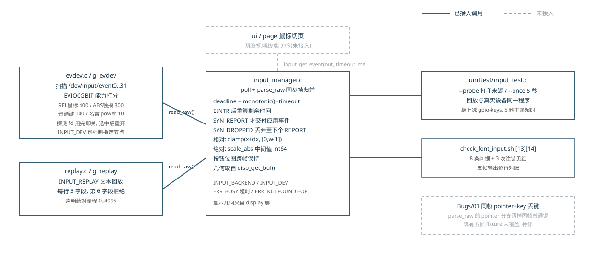

# 05 input 层：把 evdev 原始帧变成应用事件

## 一、动机

font 层（第 04 章）交付后，`project/` 能在 framebuffer 上画字。网络视频终端的
ui/page 两层（路线图刀 9）要用 USB 鼠标操作预览页、回放页、设置页，它们需要的
输入是一句完整的话："指针在 (42,21)，左键按着"。Linux 输入子系统给用户态的却是
一条条 `type/code/value` 记录：相对位移、按钮翻转、绝对坐标各是独立记录，直到
`SYN_REPORT` 才构成同一帧。两种粒度之间的归并规则必须有人定，这就是 input 层。

课程量产工具的 input 层用读取线程、环形队列和条件变量送事件。阅读它的源码能
确认三个缺陷：队列满时新事件无任何观测地消失；条件等待没有用循环重查条件；
线程没有完整的停止协议。本项目第 07 章才引入多线程，本章若照搬这份设计，
输入语义和并发缺陷会绑死在一起，两件事都验不清。

定稿实现把两件事分开：provider 只读原始记录（真实 evdev 或文本回放），
manager 在调用线程里用 `poll` 等待、按同步帧归并。两个 provider 挂同一条注册
链表；确定性回放把相对、绝对、按键、按钮、丢帧和半帧 EOF 全部变成自动判据。

## 二、为什么是这几步

```
I1  定义原始事件、应用事件和 provider 边界
I2  写 replay，把输入语义变成可重复数据
I3  写 SYN 帧聚合、坐标换算和按钮状态机
I4  写 evdev 探测、选择和读取
I5  本机注错见红、ARM 同输入复跑与板上真实节点探测
```

工作量由输入数据的性质推出。内核给的一条记录只有五个数（秒、微秒、type、code、
value），它没有坐标语义；应用要的事件带屏幕坐标、本帧位移和持续按钮位图，
不需要认识 `EV_REL` 这类内核常量。两个粒度各有自己的字段，硬塞进一个结构体，
上层就得自己认内核事件码，每个页面都会写出不一样的归并规则——I1 因此先定两个
结构体和四个 provider 动作（open/close/get_fd/read_raw）。

I2 必须早于 I4：鼠标动作无法稳定重放，WSL 里也没有 evdev 节点可造，语义验证
只能靠把记录序列写成文本、逐行喂给同一个 manager。I3 决定应用看到的语义
（何时封帧、如何钳位、按钮怎么保持），先用回放把它精确钉死。I4 只负责把内核
ABI 翻译成内部原始结构，硬件差异到此为止，不污染聚合器。I5 收口：本机注错、
同一份回放在 ARM 上复跑排除 ABI 差异、板上对真实节点做一次有限等待探测。
缺 I2，I3 的每条判据都依赖硬件；缺 I4，板上无路可走；两类验证少一项，
"input 层可用"就有一半是猜的。

图 1 是本章结束时的状态。



**图 1** 左列两个 provider 挂同一条注册链表，manager 在调用线程里同步归并；
右列上两框是本章的验收通路，灰色虚线框是已登记未修复的缺陷，虚线上方是
按同一接口接下去的 ui/page，本章不做。

## 三、每一步做了什么

### 3.1 两级事件接口

```
struct input_raw_event            struct input_event_data
  sec, usec        时间戳          sec, usec
  type             EV_*            kind       POINTER / KEY
  code             REL_X/KEY_A/..  x, y       屏幕坐标(绝对/钳位后)
  value            位移/0/1/2      dx, dy     本帧相对位移
                                   buttons    持续按钮位图
                                   code/value 仅 KEY 有意义
```

`input_source_info` 记录设备名、路径、三种能力位和绝对轴量程：manager 换算
绝对坐标要用它，板上诊断也要读它。provider 只有 open/close/get_fd/read_raw
四个动作，超时、帧边界和状态全部在 manager——两个后端因此得到完全相同的
应用行为。

### 3.2 文本回放后端

回放文件每行五个数 `sec usec type code value`，`#` 与空行跳过。
`replay_read_raw()` 用 `sscanf("%lld %lld %u %u %d %c", ...)` 读，末尾多挂一个
`%c` 捕捉多余字段：合法行恰好返回 5，带第六个词的行返回值是 6，判为 `ERR_IO`。
正常 EOF 返回 `ERR_NOTFOUND`，读错误用 `ferror` 区分。它对外声明 0..4095 的
绝对轴量程，同一份文件于是能验证缩放到 64x32 假屏的换算。

`FILE *` 与 fd 的所有权在这层分清：`fgets` 走标准 I/O 的 `FILE *`，`poll` 要
整数描述符，`replay_get_fd()` 用 `fileno()` 取，不另 open 也不另 close，
关闭只有 `fclose` 一处。

### 3.3 帧聚合与坐标

`parse_raw()` 每次处理一条原始记录，返回 1 表示一个以 `SYN_REPORT` 封口的应用
事件已产出。状态分两类，清零时机不同：

```
跨帧保存: g_x g_y g_buttons         提交后保持, 只有层 init/exit 清
本帧暂存: g_frame_dx/dy             每次提交后 reset_frame() 清
          g_abs_x/y g_have_abs_x/y
          g_pointer_changed
          g_key_code(-1)/g_key_value
丢弃标记: g_dropping                SYN_DROPPED 置位, 下一个 REPORT 清
```

```
        普通 REL/ABS/KEY
   ┌────────────────────────┐
   │                        v
[收集本帧] ──SYN_REPORT──> [交付事件并 reset_frame]
   │                          │
   └─ SYN_DROPPED             └─ 回到收集
         │
         v
   [丢弃失真记录] ── 下一个 SYN_REPORT ──> [重新收集]
```

`SYN_DROPPED` 表示内核已经丢过记录：收到时清本帧暂存、清不再可信的按钮快照、
置 `g_dropping`，此后直到下一个 `SYN_REPORT` 的记录全部忽略且不产生应用事件。
当前实现清掉按钮快照后没有向设备重查按键状态：丢帧期间物理上仍按着的按钮，
软件在设备下一次翻转按钮前无从得知，判据只覆盖"失真区间不冒充正常事件"。

相对坐标每次提交时钳进 `[0, width-1]` / `[0, height-1]`；绝对坐标先钳进设备
量程再缩放，中间值用 `int64_t` 防 `设备量程 × 屏幕宽` 溢出：

```
value' = clamp(value, min, max)
screen = (value' - min) * (limit - 1) / (max - min)
```

假屏 64 宽、量程 0..4095 时，4095 映射 63、2048 整数截断后是 31。显示几何从
`disp_get_buf()` 取，输入层不写死 1024x600 或 1280x720。`BTN_TOUCH` 与
`BTN_LEFT` 都映射到应用左键位，是当前对触摸屏的简化契约。

`input_get_event()` 用单调时钟算总 deadline：`poll` 被 `EINTR` 打断后重算
`deadline - now` 继续等，多次打断不会把 1000 ms 拖成 1600 ms。`timeout_ms=0`
表示不额外等待而非"最多读一条"——缓冲里已有半帧时，循环会继续把它们消费到
完整帧。超时映射 `ERR_BUSY`，回放 EOF 映射 `ERR_NOTFOUND`，两个返回码语义不同。

### 3.4 evdev 后端

设备编号随驱动注册和插拔变化，身份判定只能靠能力位图。`evdev_open()` 扫描
`/dev/input/event0..31`，逐个只读非阻塞打开，`EVIOCGBIT` 查询能力后打分：

| 能力 | 分数 |
|---|---:|
| REL_X 与 REL_Y 同时在位（相对鼠标） | 400 |
| ABS_X/Y 或 ABS_MT_POSITION_X/Y 在位（触摸） | 300 |
| 有普通键 | 100 |
| 有键且名字含 power | 10 |

板载 powerkey 因此抢不过 USB 鼠标。探测用的临时 fd 查完即关，选中最高分路径后
重新打开作为长期 fd，两段所有权分开。绝对设备先读 `ABS_X/Y` 量程，失败再试
`ABS_MT_POSITION_X/Y`。`evdev_read_raw()` 要求恰好读到一个
`sizeof(struct input_event)`，时间字段经 `input_event_sec/usec` 兼容宏取，
适配 32 位板子的 ABI；`EAGAIN` 返回 `ERR_BUSY` 交给 manager 继续 poll。

### 3.5 验收

`unittest/input_test.c` 同一程序三种用法：默认读到 EOF/无事件；`--probe` 只打印
来源信息；`--once` 以 5 秒超时读一帧。判据在 `check_font_input.sh` 的 [13]/[14]
两组共 8 条：五帧输出逐行对账、DROPPED 与 EOF 半帧不泄露，加三次注错见红与两条
失败路径（畸形回放、普通文件冒充 evdev）。

## 四、遇到的问题

### 4.1 参考实现的线程队列把并发缺陷提前带进输入层

**第一现场**（阅读课程源码时的笔记，无运行输出）：队列满分支直接丢弃新事件，
没有任何计数或日志；条件变量等待写在没有重查条件的 `if` 里；线程退出靠一个
没有唤醒配对的标志位。

**解读** 三处合起来意味着：压力下丢事件不可观测；虚假唤醒会把半帧当完整帧
交给上层；退出时读线程可能永远卡在 `poll` 或条件等待里。

**定位** 这三处都属于并发正确性，而第 07 章之前项目没有线程。若照搬参考设计，
本章判据就必须先解决"怎么测并发"，输入语义反而验不了。

**根因与修法** 砍掉读取线程：manager 在调用线程里 `poll` + 同步读。队满策略与
停止协议推迟到第 07 章统一设计。原判据为什么没覆盖到：课程示例的判据是"鼠标
能动"，单次短会话既压不出队满，也走不到退出竞争。

### 4.2 不能按 event 编号认设备

**第一现场**（板上，2026-09-23 实测）：未接 USB 鼠标时 `event0` 是 powerkey、
`event1` 是 gpio-keys；`lsusb` 只有 Realtek Wi-Fi、hub 与 root hub。

**解读** 板上编号由驱动注册顺序决定，插拔还会变；设备名含"mouse"也不可靠，
改名或非英文固件即失效。

**定位** 能力位图是内核对"这个设备能发什么"的权威描述，打分把它变成可比较的
序；`INPUT_DEV` 环境变量保留作诊断覆盖。

**根因与修法** 按 3.4 节的能力打分选择。原判据为什么没覆盖到：参考源码写死
`/dev/input/event1` 一条路径，换一台设备或重插一次就错，它的示例判据管不到
设备枚举。

### 4.3 不等封帧逐条上交，事件数从 5 变 12

**第一现场**（判据 [13r2] 注错输出，2026-10-03 实跑）：

```
注错: 不再等 SYN_REPORT 就提交事件
  PASS  注错见红: 应用事件个数 变成 [12]
```

**解读** 正确输出 5 个应用事件；把"普通记录后不返回 0"的反转注错放进去，
帧内中间状态（移动了 X 还没动 Y、按钮按了还没封帧）各自冒充完整事件，
5 帧拆成 12 条。

**定位** evdev 的一组记录共同描述一个采样时刻，中途任何一条都不构成应用可
消费的动作。

**根因与修法** 只有正常 `SYN_REPORT` 才提交（3.3 节状态机）。原判据为什么没
覆盖到：参考单测只打印原始记录，"应用事件"这个边界本身没有被定义过，
自然没有针对它的判据。

### 4.4 `SYN_DROPPED` 之后到下一个 REPORT 之间的失真区间漏判

**第一现场**（判据 [13r3] 注错输出，2026-10-03 实跑）：

```
注错: SYN_DROPPED 后仍解析失真记录
  PASS  注错见红: 应用事件个数 变成 [6]
```

**解读** 旧实现在 DROPPED 时清掉半帧就返回正常解析，其后到下一个 REPORT 之间
的记录（fixture 里故意插的 Y 位移与按钮翻转）被拼成第 6 个 pointer 事件。
旧 fixture 恰好让 DROPPED 后立刻接 REPORT，只证明了标记前的半帧被清掉。

**定位** 内核语义是"自上一个 REPORT 之后的数据全部不可信"，丢弃区间是
[DROPPED, 下一个 REPORT)，两端都要管。

**根因与修法** 加 `g_dropping` 状态（3.3 节状态机），丢弃区间内的记录一律忽略，
下一个 REPORT 只解除状态不交付事件；fixture 在 DROPPED 前后各放干扰记录，
加强后事件总数仍为 5。原判据为什么没覆盖到：旧 fixture 的丢帧区间长度为零，
只覆盖了状态机的一半。

### 4.5 板上没有能产生指针事件的设备

**第一现场**（板上，2026-09-23 实测）：`input_test --once` 以 5 秒超时干净退出，
全程无事件；能力打分选中 `gpio-keys path=/dev/input/event1 rel=0 abs=0 keys=1`。

**解读** 发现、打开、能力查询、有限等待、关闭路径全部走通；gpio-keys 只发
按键事件，永远不会产生 pointer。没有向 `/dev/input/event*` 写入伪造记录——
那会改变系统输入状态，也不能替代真实硬件路径。

**定位** 确定性指针语义由同一份回放文件在 ARM 上补验；真实鼠标的移动/点击
只能等硬件接入。

**根因与修法** 报告只宣称已验证的部分。原判据为什么没覆盖到：判据本身区分了
回放语义与真实设备两条线，缺口是外部硬件，记入第六节待办。

## 五、结果

测量方法：`wsl bash project/check.sh`；ARM 静态 `input_test` 加同一份回放文件
经串口上传、整文件 SHA-256 对账；板上实验经串口完成，不向设备节点注入任何事件。

| 测量项 | 改动前 | 本轮后 |
|---|---|---:|
| `project/check.sh` 总判据 | 65 PASS（04 章后） | 73 PASS / 0 FAIL / 0 SKIP（input 占 8 条） |
| input 层交付源码 | 0 行 | input/ 五个文件共 631 行 |
| 回放语义 x86 与 ARM | 未验 | 同一文件输出逐行相同 |
| ASan（回放单测） | 未跑 | 无 sanitizer 报告 |

本机回放（2026-10-03 实跑）输出精确为五行：

```
pointer x=42 y=21 dx=10 dy=5 buttons=1
pointer x=0 y=0 dx=-1000 dy=-1000 buttons=1
key code=30 value=1
pointer x=0 y=0 dx=0 dy=0 buttons=0
pointer x=63 y=0 dx=0 dy=0 buttons=1
```

第 2 帧无按钮记录但 `buttons=1`（持续位图保持），第 4 帧无位移但仍是 pointer
事件（按钮释放也是变化），第 5 帧绝对坐标 4095 缩放为 63；SYN_DROPPED 前后四条
干扰记录与 EOF 半帧不泄露。三次注错（去钳制、不等封帧、DROPPED 后继续解析）
分别变出 `x=-958`、12 条事件、6 条事件，全部见红；畸形回放退出码 2，
`/dev/null` 冒充 evdev 退出码 1。

板上（2026-09-23）：真实探测选中 `gpio-keys path=/dev/input/event1 rel=0 abs=0
keys=1`，`--once` 5 秒 poll 无事件干净超时，无残留进程。该结果只证明真实 evdev
的发现/打开/等待/关闭路径。

已知误差与不确定：板上未接 USB 鼠标，真实 pointer 移动未验证（第六节）；
DROPPED 后按钮快照不向设备重查（3.3 节），判据只覆盖失真区间不冒充事件。

## 六、还欠什么

两笔账。其一，[同帧 pointer 与普通键丢键缺陷](../../Bugs/01-同帧指针与普通键丢事件.md)：
同一 SYN 帧同时含两类动作时普通键被 `reset_frame()` 清掉，现有五帧回放没有覆盖；
复现、修法与实测修完并入本章"遇到的问题"，随后删该条目。其二，接入 USB 鼠标后
复跑现有 ARM `input_test --once` 实际移动并点击一次，确认能力打分选中相对设备
且产生 pointer 帧；不需要改代码，结果追加进本章第五节。多线程事件队列与队满
策略留到第 07 章，不在本章提前实现。
